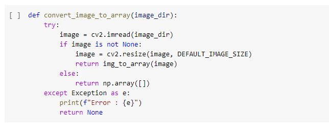
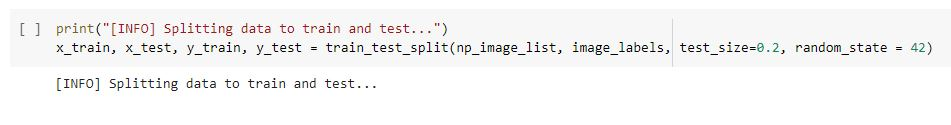
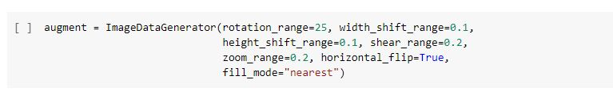
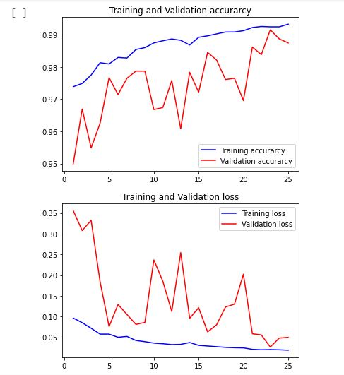
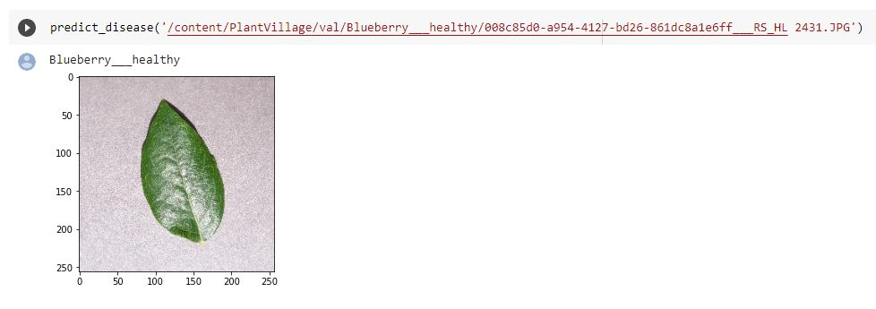
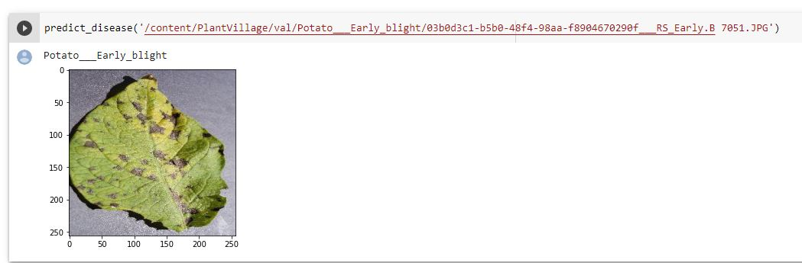

# Leaf-grade-detection-in-urban-farming-using-computer-vision-(v 1.0)
        

- Author
   1. Mushtaq Mahboob
## Description

Untrained gardeners and urban plant care takers have little knowledge of plants and identifying deteriorating leaves and plant quality. The reasons can be ranging from lack of insufficient water to excess use of manure or fertilizer. The leaf grade or quality detection can be very helpful for the people who grow plants and herbs in urban areas. Lack of understanding of the plants and leaf quality can eventually damage them permanently causing environmental as well as economic loss. Identifying the symptoms of deteriorating leaves using advanced machine learning techniques like computer vision can help these urban farmers save a lot of resources. This paper presents existing works and methods of identifying the leaves, processing the images and identifying the type of flaws or diseases the leaves are developing.

- Follow the table of contents for easy understanding of the installation instructions and roadmap of the project.
- For any queries / support regarding the project Contact: [email me](mushtaq.akram@gmail.com) or 
- If you want to contribute to this project, send me a pull request and send a message on twitter, i'll give you access.


## Table of Contents

1. [Manifest](#manifest)
2. [Dataset](#dataset)
3. [Libraries](#Libraries)
4. [Data Preprocessing](#Data-preprocessing)
5. [Data Augmentation](#Data-Augmentation)
6. [Model Training](#Model-Training)
7. [Model Evaluation](#Model-evaluation)
8. [Training & Evaluation](#Training)
9. [Testing](#Testing)
10. [References](#References)
11. [License](#License)
12. [Project Status](#Project-status)

## Manifest

```
- README.md ----> This file you are reading which has all the instructions and clear explanation of the project.
- images ---> This file contains all the images used in the readme file.
- leaf_quality_detection.ipynb ---> This file contains the actual code of the project.
- dataset ---> This folder contains the instructions to download the dataset used for the project.
```

## Dataset

- [Click here](https://drive.google.com/uc?id=18DbC6Xj4NP-hLzI14WuMaAEyq482vNfn) to download the dataset.
Publicly available data set is used for the project. The name of the dataset is "PlantVillage Disease Classification".
It was first published by crowdAI and has over 54,000 images of leaves collected under controlled environment. 
The dataset had 14 species; Apple, Blueberry, Cherry, Corn, Grape, Orange, Peach, Bell Pepper, Potato, Raspberry, Soybean, Squash, Strawberry, and Tomato.

let's download the dataset first, the dataset is stored in a GDrive for which you need unique ID. We can use the URL mentioned below to download it
I prefer using google colab because it already has many machine learning modules pre loaded or its very simple to add them with the 'pip' command if any package is missing.

```bash
pip install "package-name"
```


```py
# Download a file based on its file ID.
file_id = '18DbC6Xj4NP-hLzI14WuMaAEyq482vNfn'

# Download dataset
!gdown https://drive.google.com/uc?id={file_id}

# Unzip the downloaded file
!unzip -q PlantVillage.zip

```

## Libraries
After you download the dataset, next step is to setup your google colab notebook 
by downloading all the necessary libraries as shown below.

```py
import numpy as np
import pickle
import cv2
import os
import matplotlib.pyplot as plt
from os import listdir
from sklearn.preprocessing import LabelBinarizer
from keras.models import Sequential
from keras.layers.normalization import BatchNormalization
from keras.layers.convolutional import Conv2D
from keras.layers.convolutional import MaxPooling2D
from keras.layers.core import Activation, Flatten, Dropout, Dense
from keras import backend as K
from keras.preprocessing.image import ImageDataGenerator
from keras.optimizers import Adam
from keras.preprocessing import image
from keras.preprocessing.image import img_to_array
from sklearn.preprocessing import MultiLabelBinarizer
from sklearn.model_selection import train_test_split

```

## Data preprocessing
The next basic step to do after loading data is data preprocessing. For that we need to first understand what the data is then see various samples of the data to understand it better. Before that we need to define couple of variables to perform data preprocessing. Follow the steps as mentioned below.


1. Resize raw dataset images to the DEFAULT_IMAGE_SIZE so it can match the input shape of the main(primary) layer of the neural network.
2. Each directory of dataset varies in the number of pictures. we select the first N_IMAGES from each directory instead of all the images.
3. to access plant images set the path of the dataset in the root_dir.

Now, to make images fit for training, we need to resize the input dataset images.



- Iterate through the images and load them to numpy


- we then map each class of each plant to a unique value for the training.

In the end, we split the dataset into two sets, training & testing sets with a 0.2 split ratio. 
To train the classification model we use training set and tesingt set to validate the model.



## Data Augmentation

This technique is used to increase number of images in a dataset. Operations such as shift, rotation, zoom, and flip are performed on the image dataset to increase various perspective of the image.



## Model

Define the hyperparameters of our classification model. Execute them in a new cell it makes it easy for us to tweak them later.

```py
EPOCHS = 25
STEPS = 100
LR = 1e-3
BATCH_SIZE = 32
WIDTH = 256
HEIGHT = 256
DEPTH = 3

```

The next step is, 
1. we create a sequential model for our classification . 
2. First create a 2D Convolutional layer with 32 filters of 3 x 3 kernel for the model and a ReLU activation. 
3. perform batch normalization, max pooling, and 25% dropout operation in the following layers.
4. create two blocks of 2 Dimentional Convolutional layer with filters = 64 and ReLU activation.
5.  Repeat this step for the last set of layers with filters = 128.


## Training

Before training our model, initialize optimizer with learning rate and decay parameters. 
We select the Adam optimization technique (faster and better global minimum convergence).

## Evaluation
Plot a graph to compare the accuracy achieved by the model while minimizing loss during training period.



we see that;
1. As training accuracy increases, validation accuracy increases. 
2. As training loss decreases, validation loss decreases.
- Better result can be obtained by tweaking learning rate or by training on more images.
-To check test accuracy of a model we trained on, use evaluate() method.

## Testing

We randomly choose images from the dataset and try predicting class image for testing.





We succesfully predited the class the leaves belongs to.


**_Feel free to contact me if you have any suggestions or queries._**
**_Thank you for reading!_**

## References

1. [Paper on PlantVillage Dataset](https://arxiv.org/abs/1511.08060)
2. [Plant Disease Detection using Convolutional Neural Network](https://towardsdatascience.com/plant-ai-plant-disease-detection-using-convolutional-neural-network-9b58a96f2289)

## License
The Project currently has no license and is open source.

## Project status
- The project has succesfully reached its version 1.0
- Future ideas to enhance the project can be an android/iOS app that can be handy.
- The scalability can be increased.


