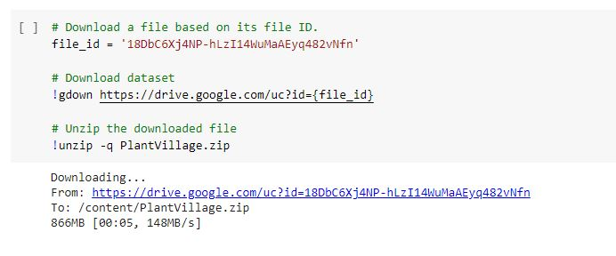
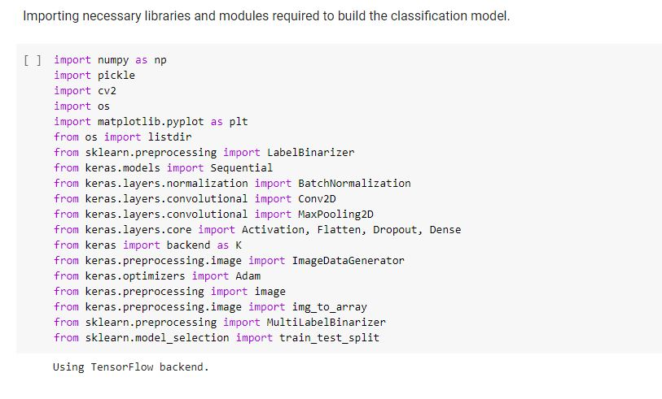
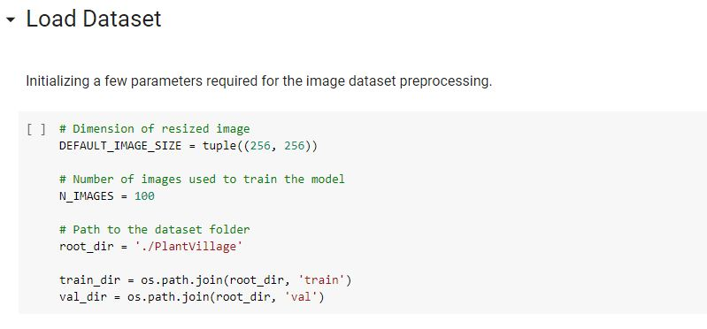

# Leaf-grade-detection-in-urban-farming-using-computer-vision-(v 1.0)
        

Untrained gardeners and urban plant care takers have little knowledge of plants and identifying deteriorating leaves and plant quality. The reasons can be ranging from lack of insufficient water to excess use of manure or fertilizer. The leaf grade or quality detection can be very helpful for the people who grow plants and herbs in urban areas. Lack of understanding of the plants and leaf quality can eventually damage them permanently causing environmental as well as economic loss. Identifying the symptoms of deteriorating leaves using advanced machine learning techniques like computer vision can help these urban farmers save a lot of resources. This paper presents existing works and methods of identifying the leaves, processing the images and identifying the type of flaws or diseases the leaves are developing.

## Table of Contents

1. [Manifest](#manifest)
2. [Dataset](#style-examples)
3. [Libraries](#embedding-code)
4. [Data Preprocessing](embedding-links)
5. [Data Augmentation](#embedding-images)
6. [Model Training](#lists-in-markdown)
7. [Model Evaluation](#necessary-things-for-a-readme)
8. [Testing](#)

## Manifest

```
- README.md ----> This markdown file you are reading.
- leaf_quality_detection.ipynb ---> This file contains the actual code of the project.
- dataset ---> This folder contains the dataset used for the project.
```

## Dataset

Publicly available data set is used for the project. The name of the dataset is "PlantVillage Disease Classification".
It was first published by crowdAI and has over 54,000 images of leaves collected under controlled environment. 
The dataset had 14 species; Apple, Blueberry, Cherry, Corn, Grape, Orange, Peach, Bell Pepper, Potato, Raspberry, Soybean, Squash, Strawberry, and Tomato.

let's download the dataset first, the dataset is stored in a GDrive for which you need unique ID. We can use the URL mentioned below to download it
I prefer using google colab because it already has many machine learning modules pre loaded or its very simple to add them with the 'pip' command.



## Libraries
After you download the dataset, next step is to setup your google colab notebook 
by downloading all the necessary libraries as shown below.




The next basic step to do after loading data is data preprocessing. For that we need to first understand what the data is then see various samples of the data to understand it better. Before that we need to define couple of variables to perform data preprocessing. Follow the steps as mentioned below.




